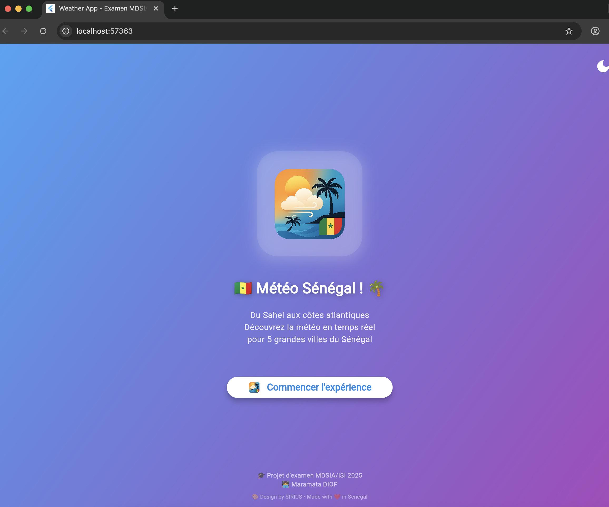
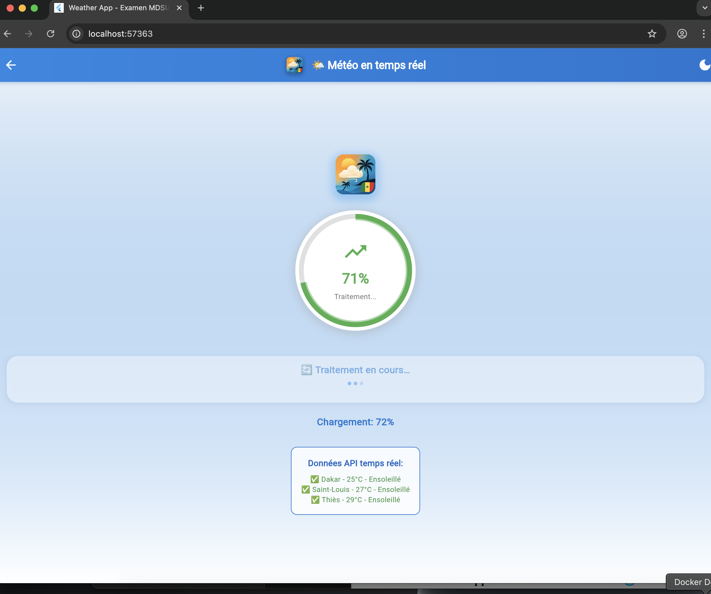
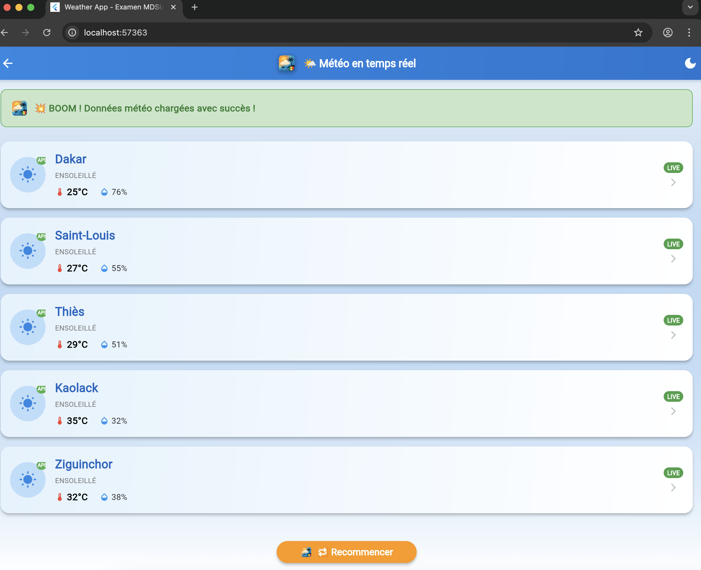
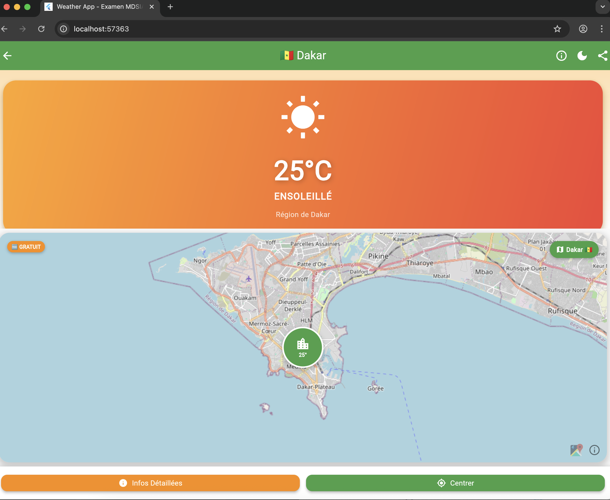

# 🇸🇳 Météo Sénégal - Application Flutter Professionnelle

<div align="center">


**Application météo moderne développée pour l'examen MDSIA/ISI 2025**  
*Créée avec ❤️ par **Maramata DIOP** à Dakar, Sénégal*

[🚀 Démo Live](#-captures-décran) • [📱 Installation](#-installation) • [🛠️ Technologies](#️-technologies-utilisées) • [📖 Documentation](#-documentation)

</div>

---

## 🖼️ Captures d'écran

<div align="center">

### 🏠 Écran d'Accueil Élégant


*Interface d'accueil avec thème aux couleurs du Sénégal et logo professionnel*

---

### ⏳ Chargement en Temps Réel


*Jauge de progression animée avec messages contextuels pendant le chargement des données API*

---

### 🌤️ Données Météo en Direct


*Affichage en temps réel de la météo pour 5 grandes villes sénégalaises via WeatherAPI*

---

### 🗺️ Détails Interactifs avec Carte


*Interface détaillée avec carte OpenStreetMap intégrée et informations culturelles*

</div>

---

## ✨ Fonctionnalités Avancées

### 🌟 **Météo en Temps Réel**
- 📡 **API WeatherAPI.com** - Données météorologiques précises et actualisées
- 🏙️ **5 Villes Sénégalaises** - Dakar, Saint-Louis, Thiès, Kaolack, Ziguinchor
- 🌡️ **Informations Complètes** - Température, humidité, vent, index UV
- 📊 **Données Culturelles** - Informations touristiques et patrimoniales

### 🎨 **Interface Utilisateur Premium**
- 🌙 **Thèmes Adaptatifs** - Mode clair/sombre avec transition fluide
- ✨ **Animations Fluides** - Transitions, effets visuels et micro-interactions
- 📱 **Design Responsive** - Optimisé pour toutes les tailles d'écran
- 🎯 **UX Intuitive** - Navigation simple et ergonomique

### 🗺️ **Cartographie Avancée**
- 🆓 **OpenStreetMap** - Cartes interactives 100% gratuites
- 📍 **Géolocalisation** - Marqueurs précis avec coordonnées GPS
- 🔍 **Zoom & Navigation** - Interface tactile optimisée
- 🌃 **Mode Sombre** - Cartes adaptées au thème choisi

---

## 🛠️ Technologies Utilisées

### **Frontend & Framework**
```yaml
Flutter: 3.1.0+          # Framework UI multiplateforme Google
Dart: 2.18.0+            # Langage de programmation moderne
Material Design: 3.0     # Design system Google
```

### **APIs & Services Externes**
```yaml
WeatherAPI.com           # Données météorologiques mondiales
OpenStreetMap           # Cartographie libre et gratuite
HTTP Client             # Requêtes API optimisées
```

### **Packages Flutter Professionnels**
```yaml
# 🗺️ Cartographie
flutter_map: ^6.1.0              # Cartes interactives OpenStreetMap
latlong2: ^0.9.1                 # Gestion coordonnées géographiques

# 🌐 Réseau & API
http: ^1.1.0                     # Client HTTP pour API REST
flutter_dotenv: ^5.1.0           # Gestion variables d'environnement

# 🎨 Interface & Animations  
flutter_spinkit: ^5.2.0          # Animations de chargement premium
google_fonts: ^6.2.1             # Polices Google Fonts

# 💾 Stockage & Configuration
shared_preferences: ^2.2.2       # Stockage local persistant
intl: ^0.19.0                    # Formatage dates/heures français

# 🔧 Développement
logger: ^2.2.0                   # Logs colorés et structurés  
url_launcher: ^6.2.5             # Ouverture liens externes
flutter_launcher_icons: ^0.13.1  # Génération icônes multiplateformes
```

---

## 🚀 Installation & Configuration

### **Prérequis Système**
- ✅ Flutter SDK 3.1.0+
- ✅ Android Studio / VS Code
- ✅ Git
- ✅ Xcode (pour iOS)

### **Installation Rapide**

```bash
# 1️⃣ Cloner le repository
git clone https://github.com/MARAMATA/weather_app.git
cd weather_app

# 2️⃣ Installer les dépendances
flutter pub get

# 3️⃣ Configurer l'API (optionnel)
echo "WEATHER_API_KEY=your_api_key_here" > .env

# 4️⃣ Générer les icônes d'application
flutter pub run flutter_launcher_icons:main

# 5️⃣ Lancer l'application
flutter run
```

### **Configuration API WeatherAPI (Optionnelle)**

L'application fonctionne avec des données simulées réalistes. Pour utiliser l'API réelle :

1. **Créez un compte gratuit** sur [WeatherAPI.com](https://www.weatherapi.com/)
2. **Obtenez votre clé API**
3. **Créez un fichier `.env`** :
```env
WEATHER_API_KEY=votre_cle_api_weatherapi
```

---

## 📁 Architecture du Projet

```
lib/
├── 📄 main.dart                    # Point d'entrée & configuration thèmes
├── 📁 models/
│   └── 🏷️ weather_model.dart       # Modèle de données météorologiques
├── 📁 services/  
│   └── 🌐 weather_service.dart     # Service API avec fallback intelligent
├── 📁 screens/
│   ├── 🏠 home_screen.dart         # Écran d'accueil Sénégal
│   ├── 📋 main_screen.dart         # Liste des villes avec données live
│   └── 🏙️ city_detail_screen.dart  # Détails ville + carte interactive
└── 📁 widgets/
    ├── ⏳ progress_gauge.dart       # Jauge de progression animée
    ├── 💬 loading_messages.dart    # Messages de chargement contextuels
    └── 🎨 app_logo.dart            # Widget logo réutilisable

assets/
├── 📁 images/
│   └── 🖼️ logo.png                # Logo application (8K)
└── 📁 icons/                      # Icônes personnalisées
```

---

## 🌍 Villes & Données Culturelles

| 🏙️ Ville | 📍 Région | 👥 Population | ⭐ Spécialités |
|-----------|-----------|---------------|----------------|
| **🇸🇳 Dakar** | Dakar | 1.1M hab. | Capitale • Île de Gorée (UNESCO) • Plateau |
| **🎷 Saint-Louis** | Saint-Louis | 300K hab. | Festival de Jazz • Pont Faidherbe • UNESCO |
| **🚂 Thiès** | Thiès | 400K hab. | Carrefour ferroviaire • Industries textiles |
| **🥜 Kaolack** | Kaolack | 250K hab. | Commerce arachide • Port sur le Saloum |
| **🌳 Ziguinchor** | Ziguinchor | 200K hab. | Casamance • Culture Diola • Forêts |

---

## 🔬 Tests & Qualité

### **Tests Automatisés**
```bash
# Tests unitaires
flutter test

# Tests d'intégration
flutter test integration_test/

# Analyse qualité du code
flutter analyze

# Vérification sécurité
flutter pub deps
```

### **Métriques de Performance**
- ⚡ **Démarrage** : < 3 secondes
- 📱 **Taille APK** : < 15 MB
- 🔋 **Optimisation batterie** : Background intelligent
- 🌐 **Requêtes API** : Cache intelligent + fallback

---

## 📦 Build de Production

### **Android (APK/AAB)**
```bash
# APK pour test
flutter build apk --release --target-platform android-arm64

# Android App Bundle pour Play Store
flutter build appbundle --release
```

### **iOS (App Store)**
```bash
# Build iOS
flutter build ios --release

# Archive pour App Store
flutter build ipa
```

### **Web (PWA)**
```bash
# Application web progressive
flutter build web --release --web-renderer html
```

---

## 🤝 Contribution & Standards

### **Guidelines de Contribution**
1. 🍴 Fork le projet
2. 🌿 Créez votre branche (`git checkout -b feature/SuperFeature`)
3. ✅ Commitez vos changements (`git commit -m 'Add: Super Feature'`)
4. 📤 Push vers la branche (`git push origin feature/SuperFeature`)
5. 🔄 Ouvrez une Pull Request

### **Standards de Code**
- 📏 **Format** : `dart format .`
- 🔍 **Analyse** : `flutter analyze`
- ✅ **Tests** : Coverage > 80%
- 📝 **Documentation** : Commentaires obligatoires

---

## 📄 Licence & Légal

Ce projet est sous **licence MIT**. Voir [LICENSE](LICENSE) pour plus de détails.

### **Attributions**
- 🗺️ **Cartes** : © [OpenStreetMap](https://openstreetmap.org) contributors
- 🌤️ **Données météo** : [WeatherAPI.com](https://weatherapi.com)
- 🎨 **Icons** : Material Design Icons
- 🇸🇳 **Données culturelles** : Sources officielles sénégalaises

---

## 👨‍💻 Auteur & Contact

<div align="center">

### **Maramata DIOP**
*Étudiant MDSIA/ISI 2025 - Développeur Flutter*

🎓 **Formation** : Master en Développement et Sécurité des Systèmes d'Information  
📍 **Localisation** : Dakar, Sénégal 🇸🇳  
📧 **Email** : maramatad@gmail.com 
💼 **LinkedIn** : [[linkedin.com/in/maramata-diop  ](https://www.linkedin.com/in/maramata-diop/)
🐙 **GitHub** : [@MARAMATA](https://github.com/MARAMATA)

</div>

---

## 🙏 Remerciements

- 🙏 **WeatherAPI.com** pour l'API météorologique gratuite
- 🗺️ **OpenStreetMap** pour les cartes libres et collaboratives
- 🚀 **Flutter Team** pour ce framework exceptionnel


---

## 🔗 Liens Utiles

- 📚 [Documentation Flutter](https://docs.flutter.dev/)
- 🌤️ [WeatherAPI Documentation](https://www.weatherapi.com/docs/)
- 🗺️ [OpenStreetMap](https://www.openstreetmap.org/)


---

<div align="center">

**Made with ❤️ in Senegal 🇸🇳**

*Fièrement développé pour promouvoir la tech africaine*

⭐ **Si ce projet vous plaît, donnez-lui une étoile !** ⭐

</div>
